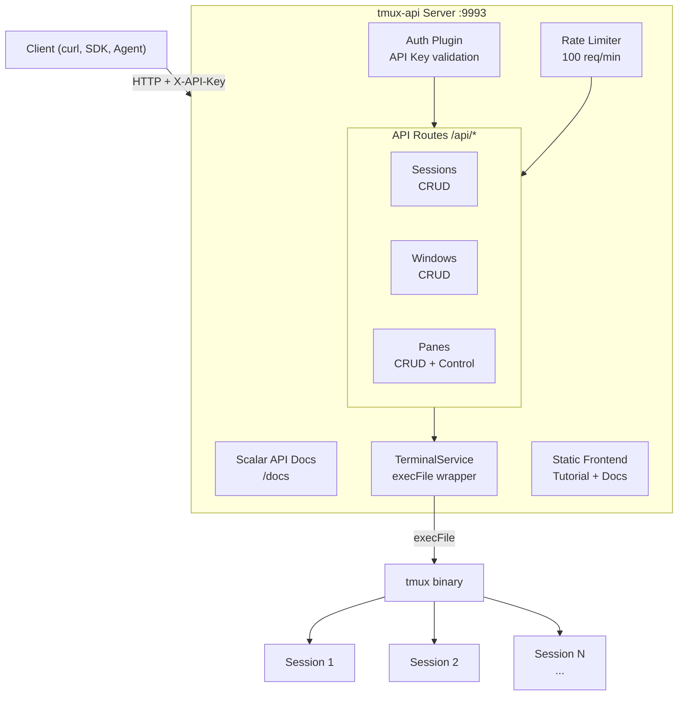
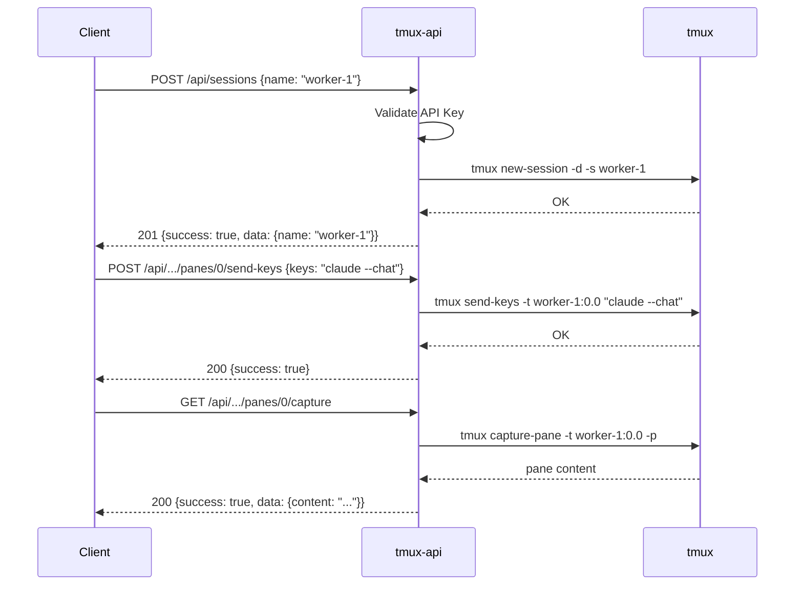
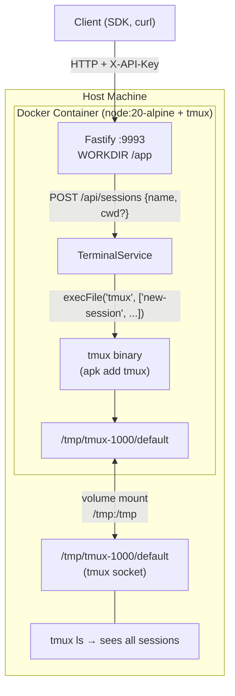

# tmux-api

[](https://www.npmjs.com/package/@yaotoshi/tmux-api)

Self-hosted REST API server for controlling tmux remotely. Deploy the server on your machine, then use the [`@yaotoshi/tmux-api`](https://www.npmjs.com/package/@yaotoshi/tmux-api) SDK (or any HTTP client) to manage tmux sessions via API. The server runs on your infrastructure — the SDK connects to it via `baseUrl`.

## Quick Start

### Docker (recommended)

Prerequisites: Docker, tmux on host (`apt install tmux` / `apk add tmux`)

```bash
cp .env.example .env   # edit API_KEY
docker compose up -d
```

> **How it works:** The Docker container only runs the tmux-api server. tmux sessions run on the **host**, not inside the container. The container connects to the host's tmux server via the Unix socket mounted at `/tmp`. This means any tools you need in tmux sessions (Claude Code, git, etc.) should be installed on the host, not in the container.

### Local (Production)

Recommended for running on a server with auto-restart on boot:

```bash
git clone https://github.com/onchainyaotoshi/tmux-api.git
cd tmux-api
sudo ./install.sh
```

This installs dependencies, builds the frontend, creates a systemd service, and starts tmux-api. Edit `.env` to set your `API_KEY` before or after install.

```bash
sudo systemctl status tmux-api      # check status
sudo systemctl restart tmux-api     # restart
journalctl -u tmux-api -f           # follow logs
sudo ./uninstall.sh                 # remove service
```

### Local (Development)

Prerequisites: Node.js 20+, tmux (`apt install tmux` / `apk add tmux`)

```bash
git clone https://github.com/onchainyaotoshi/tmux-api.git
cd tmux-api

npm install
cp .env.example .env   # edit API_KEY

# Start server
npm start

# Or dev mode (auto-reload)
npm run dev:server
```

Server runs at `http://127.0.0.1:9993` (localhost only). Port is configurable via `PORT` in `.env`.

### Expose to the Internet

```bash
cloudflared tunnel --url http://localhost:9993
```

## Node.js SDK

Install the official SDK:

```bash
npm install @yaotoshi/tmux-api
```

```js
import TmuxApi from '@yaotoshi/tmux-api'

const client = new TmuxApi({
  baseUrl: 'http://localhost:9993',
  apiKey: 'your-api-key',
})

await client.sessions.create({ name: 'worker-1', command: 'claude --chat' })
await client.terminals.panes.sendKeys('worker-1', '0', '0', { keys: 'hello' })
const output = await client.terminals.panes.capture('worker-1', '0', '0')
```

See full SDK docs: [`@yaotoshi/tmux-api` on npm](https://www.npmjs.com/package/@yaotoshi/tmux-api)

## Usage Examples (curl)

```bash
API="http://localhost:9993"
KEY="your-api-key"

# Create a session
curl -X POST $API/api/sessions \
  -H "X-API-Key: $KEY" \
  -H "Content-Type: application/json" \
  -d '{"name":"worker-1"}'

# Send command to pane
curl -X POST $API/api/sessions/worker-1/windows/0/panes/0/send-keys \
  -H "X-API-Key: $KEY" \
  -H "Content-Type: application/json" \
  -d '{"keys":"echo hello"}'

# Capture pane output
curl -s $API/api/sessions/worker-1/windows/0/panes/0/capture \
  -H "X-API-Key: $KEY" | jq .data.content
```

## API Endpoints

### Authentication

All `/api/*` endpoints require the header:
```
X-API-Key: your-api-key
```

### Sessions

| Method | Endpoint | Body | Description |
|--------|----------|------|-------------|
| GET | `/api/sessions` | - | List sessions |
| POST | `/api/sessions` | `{name}` | Create session |
| PUT | `/api/sessions/:name` | `{newName}` | Rename session |
| DELETE | `/api/sessions/:name` | - | Kill session |

### Windows

| Method | Endpoint | Body | Description |
|--------|----------|------|-------------|
| GET | `/api/sessions/:s/windows` | - | List windows |
| POST | `/api/sessions/:s/windows` | `{name?}` | Create window |
| PUT | `/api/sessions/:s/windows/:i` | `{newName}` | Rename window |
| DELETE | `/api/sessions/:s/windows/:i` | - | Kill window |

### Panes

| Method | Endpoint | Body | Description |
|--------|----------|------|-------------|
| GET | `.../:w/panes` | - | List panes |
| POST | `.../:w/panes` | `{direction: "h"\|"v"}` | Split pane |
| PUT | `.../:w/panes/:p/resize` | `{direction: "U"\|"D"\|"L"\|"R", amount}` | Resize |
| DELETE | `.../:w/panes/:p` | - | Kill pane |
| POST | `.../:w/panes/:p/send-keys` | `{keys}` | Send keys |
| GET | `.../:w/panes/:p/capture` | - | Capture output |

### API Docs

Open `http://localhost:9993/docs` for interactive API documentation (Scalar).

## Use Cases

Projects using tmux-api in production:

- **[foreman](https://github.com/onchainyaotoshi/foreman)** — AI agent orchestrator that uses tmux-api as its backend for managing multiple AI agent sessions (blueprints, lifecycle, monitoring). Each agent runs in its own tmux session, controlled entirely via tmux-api endpoints.

If you're using tmux-api in your project, feel free to open a PR to add it here!

## Development

```bash
npm run dev:server    # Server with auto-reload
npm run dev:frontend  # Vite dev server (frontend only)
npm run build         # Build frontend
npm test              # Run tests
npm run test:watch    # Watch mode
```

## Architecture



### API Flow



### How It Works (Docker)



**Key points:**
- tmux runs **inside the container** (installed via `apk add tmux`)
- `/tmp:/tmp` volume mount shares the tmux socket — sessions created via API are visible on the host (`tmux ls`) and vice versa
- Default working directory for new sessions is `/app` (container's WORKDIR). Pass `cwd` in the request body to override

## Project Structure

```
tmux-api/
├── src/
│   ├── server/
│   │   ├── index.js              # Fastify entry point
│   │   ├── plugins/
│   │   │   ├── auth.js           # API key + Bearer token auth
│   │   │   └── swagger.js        # OpenAPI + Scalar docs
│   │   ├── routes/
│   │   │   ├── terminals.js      # Terminal endpoints (L1)
│   │   │   ├── sessions.js       # Session endpoints (L2)
│   │   │   ├── windows.js        # Window endpoints
│   │   │   └── panes.js          # Pane + control endpoints
│   │   └── services/
│   │       ├── terminal.js       # TerminalService (L1, core)
│   │       └── session.js        # SessionService (L2, stateless wrapper)
│   ├── frontend/                  # React tutorial app
│   └── index.css
├── tests/                         # Vitest integration tests
├── .env.example
├── Dockerfile
├── docker-compose.yml
└── package.json
```

## License

MIT
