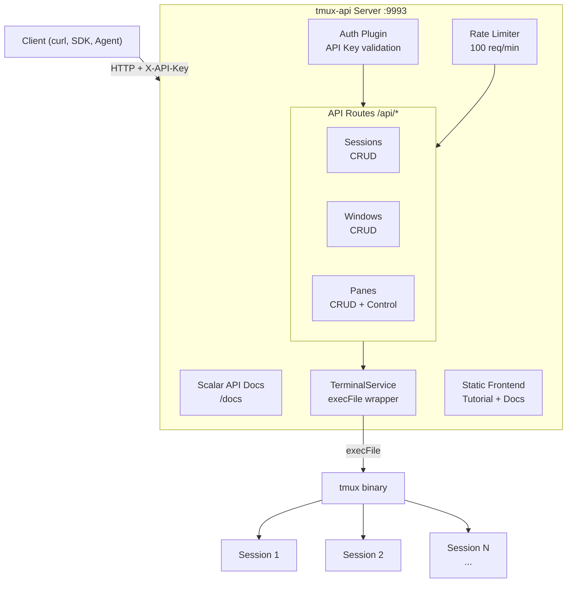

# tmux-api

[](https://www.npmjs.com/package/@yaotoshi/tmux-api)

Self-hosted REST API server for controlling tmux remotely. Deploy the server on your machine, then use the [`@yaotoshi/tmux-api`](https://www.npmjs.com/package/@yaotoshi/tmux-api) SDK (or any HTTP client) to manage tmux sessions via API.

## Quick Start

Prerequisites: Node.js 20+, tmux (`apt install tmux`)

```bash
git clone https://github.com/onchainyaotoshi/tmux-api.git
cd tmux-api
cp .env.example .env   # edit API_KEY
sudo ./install.sh
```

This installs dependencies, builds the frontend, creates a systemd service, and starts tmux-api.

```bash
sudo systemctl status tmux-api      # check status
sudo systemctl restart tmux-api     # restart
journalctl -u tmux-api -f           # follow logs
sudo ./uninstall.sh                 # remove service
```

## Environment Variables

| Variable | Default | Description |
|----------|---------|-------------|
| `API_KEY` | *(required)* | API key for authenticating requests to `/api/*` endpoints |
| `PORT` | `9993` | Server port |
| `SWAGGER_ENABLED` | `true` | Set to `"false"` to disable Scalar API docs at `/docs` |
| `FRONTEND_ENABLED` | `true` | Set to `"false"` to disable serving the frontend SPA |
| `RATE_LIMIT_MAX` | `100` | Max requests per minute per API key/token/IP. `0` to disable |
| `AUTH_ACCOUNTS_URL` | *(empty)* | Accounts service URL for Bearer token auth. Leave empty for API key auth only |

## Expose to Internet

```bash
cloudflared tunnel --url http://localhost:9993
```

## API Reference

Full API endpoints and SDK documentation: [`@yaotoshi/tmux-api` on npm](https://www.npmjs.com/package/@yaotoshi/tmux-api)

Interactive API docs available at `http://localhost:9993/docs` (Scalar) after starting the server.

## Architecture



## Use Cases

Projects using tmux-api in production:

- **[foreman](https://github.com/onchainyaotoshi/foreman)** — AI agent orchestrator that uses tmux-api as its backend for managing multiple AI agent sessions (blueprints, lifecycle, monitoring). Each agent runs in its own tmux session, controlled entirely via tmux-api endpoints.

If you're using tmux-api in your project, feel free to open a PR to add it here!

## Learn tmux

New to tmux? Check out the **[Tmux Tutorial](https://tmux-tutorial-5ww.pages.dev/)** — an interactive visual guide covering sessions, windows, panes, navigation, resize, and copy mode.

## License

MIT
